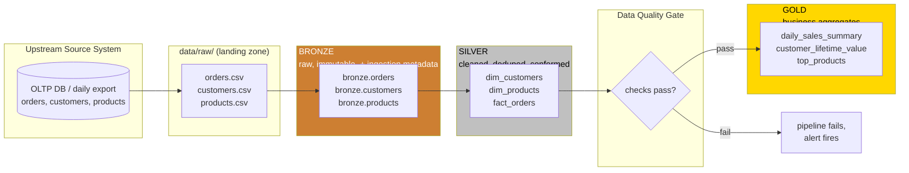
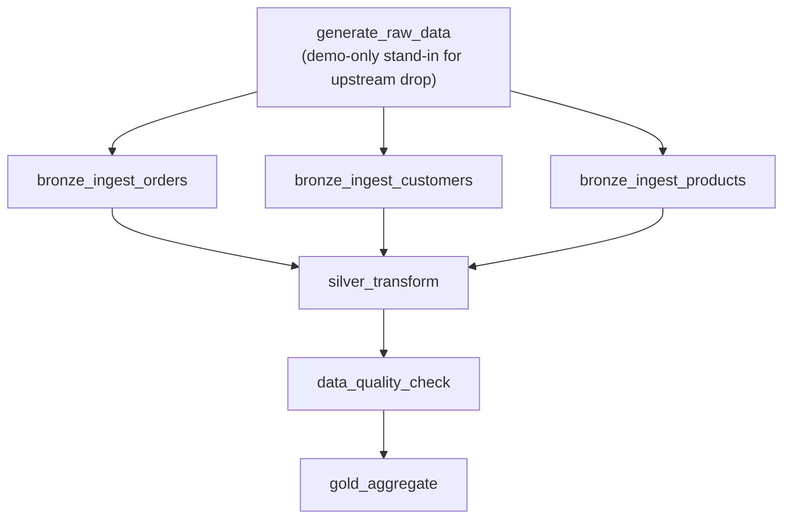

# Architecture

## Overview

This project implements a **batch medallion architecture** (Bronze → Silver → Gold),
orchestrated by **Apache Airflow**, simulating a daily extract from an
e-commerce order system.

## Orchestration (Airflow DAG)

`dags/medallion_batch_pipeline.py` defines this exact graph. It runs `@daily`,
uses Airflow's logical date (`ds`) as the `batch_date` partition key, and
fans bronze ingestion out in parallel since the three source tables don't
depend on each other.

## Why medallion?

| Layer  | Purpose | Mutability | Consumers |
|--------|---------|------------|-----------|
| Bronze | Exact copy of source + lineage metadata | Append-only, never edited | Data engineers (reprocessing) |
| Silver | Cleaned, typed, deduplicated, conformed | Rebuilt per batch | Analysts, downstream jobs |
| Gold   | Business aggregates / marts | Rebuilt from Silver history | BI tools, stakeholders |

Separating layers this way means a bug in a cleaning rule can be fixed and
**replayed from Bronze** without re-pulling from the source system — Bronze
is the durable, replayable source of truth for the lake.

## Design decisions worth calling out

- **Partitioning**: Bronze/Silver are partitioned by `batch_date` (Hive-style
  `table/batch_date=YYYY-MM-DD/`), matching how this would be laid out in
  S3 or ADLS in production, and enabling idempotent re-runs of a single day.
- **Gold is cumulative**: unlike Bronze/Silver, Gold marts are rebuilt from
  *all* Silver history each run, since metrics like lifetime value aren't
  meaningful scoped to a single day.
- **Data quality gate**: a dedicated task sits between Silver and Gold and
  fails the DAG loudly (via `retries` + Airflow alerting hooks) rather than
  letting bad data quietly reach business-facing marts.
- **ADF alternative**: this project uses Airflow because it's free to run
  locally end-to-end for a portfolio project. The same DAG structure (fan-out
  ingestion → conform → validate → aggregate) maps directly onto an **Azure
  Data Factory** pipeline using a ForEach/parallel Copy Activities stage for
  Bronze, a Data Flow or Databricks Notebook activity for Silver, a
  Validation activity for the DQ gate, and another Data Flow for Gold — see
  `docs/adf_equivalent.md` for the mapping if you'd rather present this as
  an ADF project (e.g. for Azure-focused roles).
